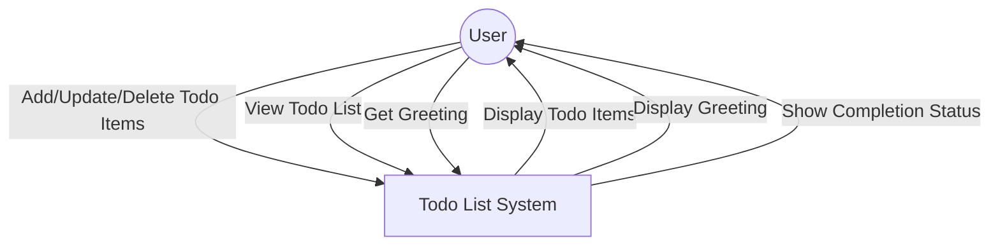
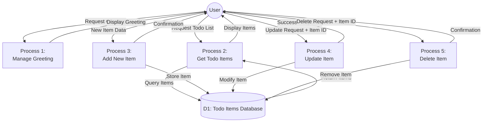
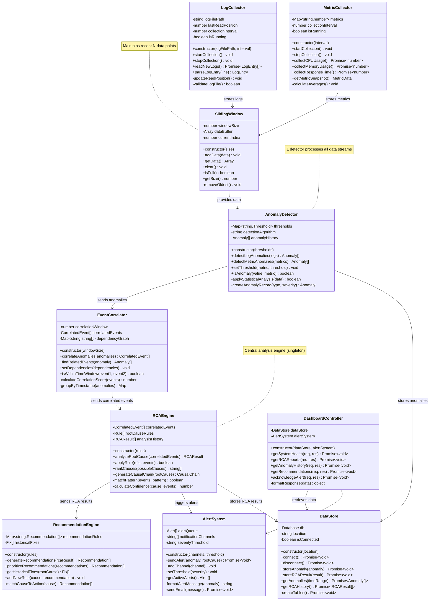

# CS331 Software Engineering Lab - Assignment 3 Solution

**Total Marks: 40**  
**Student Name:** SHIVANKIT JAISWAL 
**Date:** February 9, 2026  
**Project:** Automated Root Cause Analysis Platform (ARCA) for Deployment Errors  


## Part A: Creating the Data Flow Diagram (DFD)

### Q1. Context Diagram (Level 0 DFD) [5 Marks]

The Context Diagram shows the overall system and its interaction with external entities.



**Description:**
- **External Entity:** User - The person interacting with the todo application
- **System:** Todo List System - The complete application that manages todo items
- **Data Flows:**
  - User sends requests to add, update, delete, or view todo items
  - System returns todo items, greetings, and completion status to the user

---

### Q2. Level 1 DFD [5 Marks]

The Level 1 DFD shows the detailed processes within the system, data flows, and data stores.



**Data Stores:**
- **D1: Todo Items Database** - Stores all todo items with their ID, name, and completion status

**Processes:**
1. **Manage Greeting** - Generates personalized greeting message
2. **Get Todo Items** - Retrieves all todo items from database
3. **Add New Item** - Creates new todo item with unique ID
4. **Update Item** - Modifies existing item's name or status
5. **Delete Item** - Removes item from database

---

## Part B: Covering the Structural Aspects of the Software

### Q1. Key Classes Identification [10 Marks]

#### Class 1: LogCollector
**Attributes:**
- `- logFilePath: string` (private) - Path to log file
- `- lastReadPosition: number` (private) - Last read position in file
- `- collectionInterval: number` (private) - Data collection interval in ms
- `- isRunning: boolean` (private) - Collection status

**Methods:**
- `+ constructor(logFilePath: string, interval: number)` (public) - Initialize log collector
- `+ startCollection(): void` (public) - Start continuous log collection
- `+ stopCollection(): void` (public) - Stop log collection
- `+ readNewLogs(): Promise<LogEntry[]>` (public) - Read only new log entries
- `+ parseLogEntry(line: string): LogEntry` (public) - Parse log line to LogEntry object
- `- updateReadPosition(): void` (private) - Update last read position
- `- validateLogFile(): boolean` (private) - Check if log file exists

---

#### Class 2: MetricCollector
**Attributes:**
- `- metrics: Map<string, number>` (private) - Current metric values
- `- collectionInterval: number` (private) - Collection interval in ms
- `- isRunning: boolean` (private) - Collection status

**Methods:**
- `+ constructor(interval: number)` (public) - Initialize metric collector
- `+ startCollection(): void` (public) - Start continuous metric collection
- `+ stopCollection(): void` (public) - Stop metric collection
- `+ collectCPUUsage(): Promise<number>` (public) - Get current CPU usage
- `+ collectMemoryUsage(): Promise<number>` (public) - Get current memory usage
- `+ collectResponseTime(): Promise<number>` (public) - Get system response time
- `+ getMetricSnapshot(): MetricData` (public) - Get all current metrics
- `- calculateAverages(): void` (private) - Calculate metric averages

---

#### Class 3: AnomalyDetector
**Attributes:**
- `- thresholds: Map<string, Threshold>` (private) - Detection thresholds
- `- detectionAlgorithm: string` (private) - Algorithm type (threshold/statistical)
- `- anomalyHistory: Anomaly[]` (private) - Detected anomalies

**Methods:**
- `+ constructor(thresholds: Map<string, Threshold>)` (public) - Initialize detector
- `+ detectLogAnomalies(logs: LogEntry[]): Anomaly[]` (public) - Detect anomalies in logs
- `+ detectMetricAnomalies(metrics: MetricData): Anomaly[]` (public) - Detect metric anomalies
- `+ setThreshold(metric: string, threshold: Threshold): void` (public) - Update threshold
- `+ isAnomaly(value: number, metric: string): boolean` (public) - Check if value is anomalous
- `- applyStatisticalAnalysis(data: number[]): boolean` (private) - Statistical detection
- `- createAnomalyRecord(type: string, severity: string): Anomaly` (private) - Create anomaly object

---

#### Class 4: EventCorrelator
**Attributes:**
- `- correlationWindow: number` (private) - Time window for correlation in ms
- `- correlatedEvents: CorrelatedEvent[]` (private) - List of correlated events
- `- dependencyGraph: Map<string, string[]>` (private) - System dependency map

**Methods:**
- `+ constructor(windowSize: number)` (public) - Initialize correlator
- `+ correlateAnomalies(anomalies: Anomaly[]): CorrelatedEvent[]` (public) - Correlate related anomalies
- `+ findRelatedEvents(anomaly: Anomaly): Anomaly[]` (public) - Find related anomalies
- `+ setDependencies(dependencies: Map<string, string[]>): void` (public) - Set system dependencies
- `+ isWithinTimeWindow(event1: Anomaly, event2: Anomaly): boolean` (public) - Check time proximity
- `- calculateCorrelationScore(events: Anomaly[]): number` (private) - Calculate correlation strength
- `- groupByTimestamp(anomalies: Anomaly[]): Map<string, Anomaly[]>` (private) - Group events by time

---

#### Class 5: RCAEngine
**Attributes:**
- `- correlatedEvents: CorrelatedEvent[]` (private) - Correlated events for analysis
- `- rootCauseRules: Rule[]` (private) - Predefined RCA rules
- `- analysisHistory: RCAResult[]` (private) - Previous analysis results

**Methods:**
- `+ constructor(rules: Rule[])` (public) - Initialize RCA engine
- `+ analyzeRootCause(correlatedEvents: CorrelatedEvent[]): RCAResult` (public) - Identify root cause
- `+ applyRule(rule: Rule, events: CorrelatedEvent[]): boolean` (public) - Apply RCA rule
- `+ rankCauses(possibleCauses: string[]): string[]` (public) - Rank causes by probability
- `+ generateCausalChain(rootCause: string): CausalChain` (public) - Build cause-effect chain
- `- matchPattern(events: CorrelatedEvent[], pattern: Pattern): boolean` (private) - Pattern matching
- `- calculateConfidence(cause: string, events: CorrelatedEvent[]): number` (private) - Confidence score

---

#### Class 6: RecommendationEngine
**Attributes:**
- `- recommendationRules: Map<string, Recommendation[]>` (private) - Rules for recommendations
- `- historicalFixes: Fix[]` (private) - Previously successful fixes

**Methods:**
- `+ constructor(rules: Map<string, Recommendation[]>)` (public) - Initialize engine
- `+ generateRecommendations(rcaResult: RCAResult): Recommendation[]` (public) - Generate fix suggestions
- `+ prioritizeRecommendations(recommendations: Recommendation[]): Recommendation[]` (public) - Sort by priority
- `+ getHistoricalFixes(rootCause: string): Fix[]` (public) - Get past successful fixes
- `+ addNewRule(cause: string, recommendation: Recommendation): void` (public) - Add recommendation rule
- `- matchCauseToAction(cause: string): Recommendation[]` (private) - Map cause to actions

---

#### Class 7: SlidingWindow
**Attributes:**
- `- windowSize: number` (private) - Maximum window size
- `- dataBuffer: Array<any>` (private) - Circular buffer for data
- `- currentIndex: number` (private) - Current position in buffer

**Methods:**
- `+ constructor(size: number)` (public) - Initialize sliding window
- `+ addData(data: any): void` (public) - Add new data to window
- `+ getData(): Array<any>` (public) - Get all data in window
- `+ clear(): void` (public) - Clear all data
- `+ isFull(): boolean` (public) - Check if window is full
- `+ getSize(): number` (public) - Get current data count
- `- removeOldest(): void` (private) - Remove oldest entry

---

#### Class 8: DashboardController
**Attributes:**
- `- dataStore: DataStore` (private) - Database handler
- `- alertSystem: AlertSystem` (private) - Alert system instance

**Methods:**
- `+ constructor(dataStore: DataStore, alertSystem: AlertSystem)` (public) - Initialize controller
- `+ getSystemHealth(req: Request, res: Response): Promise<void>` (public) - Get health status
- `+ getRCAReports(req: Request, res: Response): Promise<void>` (public) - Get RCA reports
- `+ getAnomalyHistory(req: Request, res: Response): Promise<void>` (public) - Get anomaly logs
- `+ getRecommendations(req: Request, res: Response): Promise<void>` (public) - Get fix suggestions
- `+ acknowledgeAlert(req: Request, res: Response): Promise<void>` (public) - Mark alert as read
- `- formatResponse(data: any): object` (private) - Format API response

---

#### Class 9: AlertSystem
**Attributes:**
- `- alertQueue: Alert[]` (private) - Pending alerts
- `- notificationChannels: string[]` (private) - Email, SMS, etc.
- `- severityThreshold: string` (private) - Minimum severity to alert

**Methods:**
- `+ constructor(channels: string[], threshold: string)` (public) - Initialize alert system
- `+ sendAlert(anomaly: Anomaly, rootCause: string): Promise<void>` (public) - Send alert notification
- `+ addChannel(channel: string): void` (public) - Add notification channel
- `+ setThreshold(severity: string): void` (public) - Set alert threshold
- `+ getActiveAlerts(): Alert[]` (public) - Get unacknowledged alerts
- `- formatAlertMessage(anomaly: Anomaly): string` (private) - Create alert message
- `- sendEmail(message: string): Promise<void>` (private) - Send email notification

---

#### Class 10: DataStore
**Attributes:**
- `- db: Database` (private) - Database connection
- `- location: string` (private) - Database file path
- `- isConnected: boolean` (private) - Connection status

**Methods:**
- `+ constructor(location: string)` (public) - Initialize data store
- `+ connect(): Promise<void>` (public) - Connect to database
- `+ disconnect(): Promise<void>` (public) - Close connection
- `+ storeAnomaly(anomaly: Anomaly): Promise<void>` (public) - Save anomaly record
- `+ storeRCAResult(result: RCAResult): Promise<void>` (public) - Save RCA result
- `+ getAnomalies(timeRange: TimeRange): Promise<Anomaly[]>` (public) - Query anomalies
- `+ getRCAHistory(): Promise<RCAResult[]>` (public) - Get past RCA results
- `- createTables(): Promise<void>` (private) - Initialize database schema

---

### Q2. UML Class Diagram [10 Marks]



**Relationships:**

**Data Flow Chain:**
1. **Association** (LogCollector → SlidingWindow): LogCollector stores parsed log entries in window
   - Cardinality: 1 to 1
2. **Association** (MetricCollector → SlidingWindow): MetricCollector stores metrics in window
   - Cardinality: 1 to 1
3. **Association** (SlidingWindow → AnomalyDetector): Window provides data for anomaly detection
   - Cardinality: 1 to 1
4. **Association** (AnomalyDetector → EventCorrelator): Detector sends anomalies for correlation
   - Cardinality: 1 to 1
5. **Association** (EventCorrelator → RCAEngine): Correlator sends grouped events for RCA
   - Cardinality: 1 to 1
6. **Association** (RCAEngine → RecommendationEngine): Engine sends RCA results for recommendations
   - Cardinality: 1 to 1
7. **Association** (RCAEngine → AlertSystem): Engine triggers alerts for critical issues
   - Cardinality: 1 to 1

**Storage & Interface:**
8. **Association** (AnomalyDetector → DataStore): Stores detected anomalies
   - Cardinality: 1 to 1
9. **Association** (RCAEngine → DataStore): Persists RCA results
   - Cardinality: 1 to 1
10. **Association** (DashboardController → DataStore): Retrieves historical data
    - Cardinality: 1 to 1
11. **Association** (DashboardController → AlertSystem): Manages alert acknowledgments
    - Cardinality: 1 to 1

---

## Part C: Implementation of Key Modules

### Module 1: AnomalyDetector Class Implementation [5 Marks]

This module implements the core anomaly detection logic for identifying abnormal system behavior.

```python
from typing import List, Dict, Optional
from datetime import datetime
import statistics

class Anomaly:
    """Represents a detected anomaly"""
    def __init__(self, anomaly_type: str, severity: str, value: float, 
                 metric_name: str, timestamp: datetime, description: str):
        self.anomaly_type = anomaly_type
        self.severity = severity  # "LOW", "MEDIUM", "HIGH", "CRITICAL"
        self.value = value
        self.metric_name = metric_name
        self.timestamp = timestamp
        self.description = description
        self.id = f"{metric_name}_{timestamp.strftime('%Y%m%d_%H%M%S')}"
    
    def to_dict(self):
        """Convert anomaly to dictionary"""
        return {
            'id': self.id,
            'type': self.anomaly_type,
            'severity': self.severity,
            'value': self.value,
            'metric': self.metric_name,
            'timestamp': self.timestamp.isoformat(),
            'description': self.description
        }

class Threshold:
    """Threshold configuration for anomaly detection"""
    def __init__(self, min_value: Optional[float] = None, 
                 max_value: Optional[float] = None,
                 std_dev_multiplier: float = 2.0):
        self.min_value = min_value
        self.max_value = max_value
        self.std_dev_multiplier = std_dev_multiplier

class AnomalyDetector:
    """
    AnomalyDetector Class
    Detects anomalies in system logs and metrics using threshold-based 
    and statistical methods
    """
    
    def __init__(self, thresholds: Dict[str, Threshold]):
        \"\"\"
        Initialize AnomalyDetector
        
        Args:
            thresholds: Dictionary mapping metric names to Threshold objects
        \"\"\"
        if not isinstance(thresholds, dict):
            raise ValueError("Thresholds must be a dictionary")
        
        self.thresholds = thresholds
        self.detection_algorithm = "hybrid"  # threshold + statistical
        self.anomaly_history: List[Anomaly] = []
        self._baseline_data: Dict[str, List[float]] = {}
    
    def detect_log_anomalies(self, logs: List[Dict]) -> List[Anomaly]:
        \"\"\"
        Detect anomalies in log entries
        
        Args:
            logs: List of log entry dictionaries with 'level', 'message', 'timestamp'
        
        Returns:
            List of detected Anomaly objects
        \"\"\"
        if not logs:
            return []
        
        anomalies = []
        error_count = 0
        critical_count = 0
        
        for log in logs:
            level = log.get('level', '').upper()
            message = log.get('message', '')
            timestamp = log.get('timestamp', datetime.now())
            
            # Detect ERROR level logs
            if level == 'ERROR':
                error_count += 1
                anomaly = self._create_anomaly_record(
                    anomaly_type='LOG_ERROR',
                    severity='HIGH',
                    value=1.0,
                    metric_name='error_logs',
                    timestamp=timestamp,
                    description=f"Error in logs: {message[:100]}"
                )
                anomalies.append(anomaly)
            
            # Detect CRITICAL level logs
            elif level == 'CRITICAL':
                critical_count += 1
                anomaly = self._create_anomaly_record(
                    anomaly_type='LOG_CRITICAL',
                    severity='CRITICAL',
                    value=1.0,
                    metric_name='critical_logs',
                    timestamp=timestamp,
                    description=f"Critical error: {message[:100]}"
                )
                anomalies.append(anomaly)
            
            # Detect deployment-related keywords
            deployment_keywords = ['deployment failed', 'deploy error', 
                                  'rollback', 'connection refused', 
                                  'timeout', 'out of memory']
            
            if any(keyword in message.lower() for keyword in deployment_keywords):
                anomaly = self._create_anomaly_record(
                    anomaly_type='DEPLOYMENT_ERROR',
                    severity='CRITICAL',
                    value=1.0,
                    metric_name='deployment_errors',
                    timestamp=timestamp,
                    description=f"Deployment issue detected: {message[:100]}"
                )
                anomalies.append(anomaly)
        
        # Store in history
        self.anomaly_history.extend(anomalies)
        
        return anomalies
    
    def detect_metric_anomalies(self, metrics: Dict[str, float]) -> List[Anomaly]:
        \"\"\"
        Detect anomalies in performance metrics
        
        Args:
            metrics: Dictionary of metric name to value
        
        Returns:
            List of detected Anomaly objects
        \"\"\"
        if not metrics:
            return []
        
        anomalies = []
        timestamp = datetime.now()
        
        for metric_name, value in metrics.items():
            # Check if we have a threshold for this metric
            if metric_name in self.thresholds:
                threshold = self.thresholds[metric_name]
                
                # Threshold-based detection
                if self.is_anomaly(value, metric_name):
                    severity = self._calculate_severity(value, metric_name)
                    
                    anomaly = self._create_anomaly_record(
                        anomaly_type='METRIC_THRESHOLD',
                        severity=severity,
                        value=value,
                        metric_name=metric_name,
                        timestamp=timestamp,
                        description=f"{metric_name} = {value:.2f} exceeds threshold"
                    )
                    anomalies.append(anomaly)
            
            # Update baseline data for statistical analysis
            if metric_name not in self._baseline_data:
                self._baseline_data[metric_name] = []
            self._baseline_data[metric_name].append(value)
            
            # Keep only recent 100 data points
            if len(self._baseline_data[metric_name]) > 100:
                self._baseline_data[metric_name].pop(0)
            
            # Statistical anomaly detection (if enough baseline data)
            if len(self._baseline_data[metric_name]) >= 10:
                if self._apply_statistical_analysis(
                    self._baseline_data[metric_name], value
                ):
                    anomaly = self._create_anomaly_record(
                        anomaly_type='METRIC_STATISTICAL',
                        severity='MEDIUM',
                        value=value,
                        metric_name=metric_name,
                        timestamp=timestamp,
                        description=f"{metric_name} = {value:.2f} is statistically anomalous"
                    )
                    anomalies.append(anomaly)
        
        # Store in history
        self.anomaly_history.extend(anomalies)
        
        return anomalies
    
    def is_anomaly(self, value: float, metric: str) -> bool:
        \"\"\"
        Check if a value is anomalous based on configured thresholds
        
        Args:
            value: Metric value to check
            metric: Metric name
        
        Returns:
            True if value exceeds threshold, False otherwise
        \"\"\"
        if metric not in self.thresholds:
            return False
        
        threshold = self.thresholds[metric]
        
        # Check min threshold
        if threshold.min_value is not None and value < threshold.min_value:
            return True
        
        # Check max threshold
        if threshold.max_value is not None and value > threshold.max_value:
            return True
        
        return False
    
    def set_threshold(self, metric: str, threshold: Threshold) -> None:
        \"\"\"
        Update or add a threshold for a metric
        
        Args:
            metric: Metric name
            threshold: Threshold object
        \"\"\"
        if not isinstance(threshold, Threshold):
            raise ValueError("threshold must be a Threshold object")
        
        self.thresholds[metric] = threshold
    
    def _apply_statistical_analysis(self, data: List[float], 
                                   new_value: float) -> bool:
        \"\"\"
        Apply statistical analysis to detect anomalies
        Uses standard deviation method
        
        Args:
            data: Historical data points
            new_value: New value to check
        
        Returns:
            True if new_value is anomalous
        \"\"\"
        if len(data) < 3:
            return False
        
        try:
            mean = statistics.mean(data)
            std_dev = statistics.stdev(data)
            
            # Get multiplier from threshold if available
            multiplier = 2.0
            for metric, threshold in self.thresholds.items():
                if threshold.std_dev_multiplier:
                    multiplier = threshold.std_dev_multiplier
                    break
            
            # Check if value is beyond N standard deviations
            lower_bound = mean - (multiplier * std_dev)
            upper_bound = mean + (multiplier * std_dev)
            
            return new_value < lower_bound or new_value > upper_bound
            
        except Exception as e:
            print(f"Statistical analysis error: {e}")
            return False
    
    def _create_anomaly_record(self, anomaly_type: str, severity: str, 
                              value: float, metric_name: str, 
                              timestamp: datetime, description: str) -> Anomaly:
        \"\"\"
        Create an Anomaly object
        
        Args:
            anomaly_type: Type of anomaly
            severity: Severity level
            value: Metric value
            metric_name: Name of metric
            timestamp: When anomaly occurred
            description: Human-readable description
        
        Returns:
            Anomaly object
        \"\"\"
        return Anomaly(
            anomaly_type=anomaly_type,
            severity=severity,
            value=value,
            metric_name=metric_name,
            timestamp=timestamp,
            description=description
        )
    
    def _calculate_severity(self, value: float, metric: str) -> str:
        \"\"\"
        Calculate severity based on how much threshold is exceeded
        
        Args:
            value: Metric value
            metric: Metric name
        
        Returns:
            Severity string: "LOW", "MEDIUM", "HIGH", "CRITICAL"
        \"\"\"
        if metric not in self.thresholds:
            return "MEDIUM"
        
        threshold = self.thresholds[metric]
        
        if threshold.max_value:
            if value > threshold.max_value * 2:
                return "CRITICAL"
            elif value > threshold.max_value * 1.5:
                return "HIGH"
            elif value > threshold.max_value * 1.2:
                return "MEDIUM"
        
        return "LOW"
    
    def get_anomaly_history(self, limit: int = 50) -> List[Anomaly]:
        \"\"\"Get recent anomalies\"\"\"
        return self.anomaly_history[-limit:]
    
    def clear_history(self) -> None:
        \"\"\"Clear anomaly history\"\"\"
        self.anomaly_history.clear()


# Example usage and testing
if __name__ == "__main__":
    # Define thresholds
    thresholds = {
        'cpu_usage': Threshold(min_value=0, max_value=80),
        'memory_usage': Threshold(min_value=0, max_value=85),
        'response_time': Threshold(min_value=0, max_value=2000),  # ms
    }
    
    # Create detector
    detector = AnomalyDetector(thresholds)
    
    # Test log anomaly detection
    logs = [
        {'level': 'INFO', 'message': 'System started', 
         'timestamp': datetime.now()},
        {'level': 'ERROR', 'message': 'Database connection failed', 
         'timestamp': datetime.now()},
        {'level': 'CRITICAL', 'message': 'Deployment failed: timeout error', 
         'timestamp': datetime.now()},
    ]
    
    log_anomalies = detector.detect_log_anomalies(logs)
    print(f"\\nDetected {len(log_anomalies)} log anomalies:")
    for anomaly in log_anomalies:
        print(f"  - {anomaly.severity}: {anomaly.description}")
    
    # Test metric anomaly detection
    metrics = {
        'cpu_usage': 95.5,      # Anomalous (> 80)
        'memory_usage': 70.0,   # Normal
        'response_time': 3500,  # Anomalous (> 2000)
    }
    
    metric_anomalies = detector.detect_metric_anomalies(metrics)
    print(f"\\nDetected {len(metric_anomalies)} metric anomalies:")
    for anomaly in metric_anomalies:
        print(f"  - {anomaly.severity}: {anomaly.description}")
```

---

### Module 2: RCAEngine Class Implementation [5 Marks]

This module implements the root cause analysis engine that identifies the origin of failures.

```python
from typing import List, Dict, Optional
from datetime import datetime, timedelta
from dataclasses import dataclass

@dataclass
class CorrelatedEvent:
    \"\"\"Group of related anomalies\"\"\"
    anomalies: List  # List of Anomaly objects
    correlation_score: float
    time_window: str
    affected_components: List[str]

@dataclass
class Rule:
    \"\"\"RCA rule definition\"\"\"
    rule_id: str
    pattern: Dict[str, any]
    root_cause: str
    confidence: float
    description: str

@dataclass
class RCAResult:
    \"\"\"Root cause analysis result\"\"\"
    root_cause: str
    confidence: float
    affected_components: List[str]
    causal_chain: List[str]
    evidence: List[Dict]
    recommendations: List[str]
    timestamp: datetime

class RCAEngine:
    \"\"\"
    RCAEngine Class
    Identifies root causes of system failures by analyzing correlated events
    and applying predefined rules
    \"\"\"
    
    def __init__(self, rules: List[Rule]):
        \"\"\"
        Initialize RCA Engine
        
        Args:
            rules: List of Rule objects for root cause identification
        \"\"\"
        if not isinstance(rules, list):
            raise ValueError("Rules must be a list")
        
        self.root_cause_rules = rules
        self.correlated_events: List[CorrelatedEvent] = []
        self.analysis_history: List[RCAResult] = []
        
        # Default rules if none provided
        if not self.root_cause_rules:
            self.root_cause_rules = self._get_default_rules()
    
    def analyze_root_cause(self, correlated_events: List[CorrelatedEvent]) -> RCAResult:
        \"\"\"
        Analyze correlated events to identify root cause
        
        Args:
            correlated_events: List of CorrelatedEvent objects
        
        Returns:
            RCAResult object with identified root cause
        \"\"\"
        if not correlated_events:
            return RCAResult(
                root_cause="UNKNOWN",
                confidence=0.0,
                affected_components=[],
                causal_chain=[],
                evidence=[],
                recommendations=["No events to analyze"],
                timestamp=datetime.now()
            )
        
        self.correlated_events = correlated_events
        
        # Extract all anomalies from correlated events
        all_anomalies = []
        for ce in correlated_events:
            all_anomalies.extend(ce.anomalies)
        
        # Find matching rules
        possible_causes = []
        
        for rule in self.root_cause_rules:
            if self.apply_rule(rule, correlated_events):
                confidence = self._calculate_confidence(
                    rule.root_cause, correlated_events
                )
                possible_causes.append({
                    'cause': rule.root_cause,
                    'confidence': confidence,
                    'rule': rule
                })
        
        # Rank causes by confidence
        if possible_causes:
            sorted_causes = sorted(
                possible_causes, 
                key=lambda x: x['confidence'], 
                reverse=True
            )
            best_match = sorted_causes[0]
            root_cause = best_match['cause']
            confidence = best_match['confidence']
            rule = best_match['rule']
        else:
            # No rules matched - infer from anomaly patterns
            root_cause = self._infer_root_cause(all_anomalies)
            confidence = 0.5
            rule = None
        
        # Build causal chain
        causal_chain = self.generate_causal_chain(root_cause, all_anomalies)
        
        # Extract affected components
        affected = set()
        for ce in correlated_events:
            affected.update(ce.affected_components)
        
        # Gather evidence
        evidence = [
            {
                'type': a.anomaly_type,
                'metric': a.metric_name,
                'value': a.value,
                'severity': a.severity,
                'timestamp': a.timestamp.isoformat()
            }
            for a in all_anomalies[:10]  # Limit to top 10
        ]
        
        # Generate recommendations
        recommendations = self._generate_recommendations(root_cause, rule)
        
        # Create result
        result = RCAResult(
            root_cause=root_cause,
            confidence=confidence,
            affected_components=list(affected),
            causal_chain=causal_chain,
            evidence=evidence,
            recommendations=recommendations,
            timestamp=datetime.now()
        )
        
        # Store in history
        self.analysis_history.append(result)
        
        return result
    
    def apply_rule(self, rule: Rule, events: List[CorrelatedEvent]) -> bool:
        \"\"\"
        Check if a rule matches the given events
        
        Args:
            rule: Rule to apply
            events: List of CorrelatedEvent objects
        
        Returns:
            True if rule matches
        \"\"\"
        pattern = rule.pattern
        
        # Extract all anomalies
        all_anomalies = []
        for ce in events:
            all_anomalies.extend(ce.anomalies)
        
        # Check required anomaly types
        if 'required_types' in pattern:
            anomaly_types = {a.anomaly_type for a in all_anomalies}
            required = set(pattern['required_types'])
            if not required.issubset(anomaly_types):
                return False
        
        # Check severity threshold
        if 'min_severity' in pattern:
            severities = {'LOW': 1, 'MEDIUM': 2, 'HIGH': 3, 'CRITICAL': 4}
            min_sev = severities.get(pattern['min_severity'], 0)
            has_severe = any(
                severities.get(a.severity, 0) >= min_sev 
                for a in all_anomalies
            )
            if not has_severe:
                return False
        
        # Check minimum event count
        if 'min_events' in pattern:
            if len(all_anomalies) < pattern['min_events']:
                return False
        
        # Check affected components
        if 'components' in pattern:
            all_components = set()
            for ce in events:
                all_components.update(ce.affected_components)
            
            required_components = set(pattern['components'])
            if not required_components.issubset(all_components):
                return False
        
        return True
    
    def rank_causes(self, possible_causes: List[str]) -> List[str]:
        \"\"\"
        Rank possible causes by probability
        
        Args:
            possible_causes: List of cause strings
        
        Returns:
            Sorted list of causes (highest probability first)
        \"\"\"
        # In a real system, this would use historical data
        # For now, use simple heuristics
        
        priority_order = [
            'DEPLOYMENT_CONFIGURATION_ERROR',
            'RESOURCE_EXHAUSTION',
            'NETWORK_CONNECTIVITY',
            'DATABASE_FAILURE',
            'APPLICATION_BUG',
            'EXTERNAL_DEPENDENCY_FAILURE'
        ]
        
        ranked = []
        for cause in priority_order:
            if cause in possible_causes:
                ranked.append(cause)
        
        # Add remaining causes
        for cause in possible_causes:
            if cause not in ranked:
                ranked.append(cause)
        
        return ranked
    
    def generate_causal_chain(self, root_cause: str, 
                            anomalies: List) -> List[str]:
        \"\"\"
        Generate cause-effect chain from root cause to observed symptoms
        
        Args:
            root_cause: Identified root cause
            anomalies: List of anomalies
        
        Returns:
            List of causal steps
        \"\"\"
        # Define causal chains for common root causes
        chains = {
            'DEPLOYMENT_CONFIGURATION_ERROR': [
                '1. Deployment initiated with incorrect configuration',
                '2. Application fails to start or load settings',
                '3. Connection errors and timeouts occur',
                '4. System logs show critical errors',
                '5. Service becomes unavailable'
            ],
            'RESOURCE_EXHAUSTION': [
                '1. Resource usage gradually increases',
                '2. Threshold limits are exceeded (CPU/Memory)',
                '3. System performance degrades',
                '4. Timeouts and failures occur',
                '5. Service becomes unresponsive'
            ],
            'DATABASE_FAILURE': [
                '1. Database connection pool exhausted',
                '2. Database queries timeout',
                '3. Application layer errors increase',
                '4. Data operations fail',
                '5. User-facing features break'
            ],
            'NETWORK_CONNECTIVITY': [
                '1. Network interruption occurs',
                '2. Services lose connectivity',
                '3. API calls timeout',
                '4. Cascading failures in dependent services',
                '5. System-wide degradation'
            ]
        }
        
        return chains.get(root_cause, [
            f'1. {root_cause} occurred',
            '2. System anomalies detected',
            '3. Service degradation observed',
            '4. Failures propagated through system'
        ])
    
    def _calculate_confidence(self, cause: str, 
                            events: List[CorrelatedEvent]) -> float:
        \"\"\"
        Calculate confidence score for a root cause
        
        Args:
            cause: Root cause string
            events: Correlated events
        
        Returns:
            Confidence score (0.0 to 1.0)
        \"\"\"
        # Base confidence from rule
        base_confidence = 0.6
        
        # Increase confidence based on evidence strength
        all_anomalies = []
        for ce in events:
            all_anomalies.extend(ce.anomalies)
        
        # More critical anomalies = higher confidence
        critical_count = sum(1 for a in all_anomalies if a.severity == 'CRITICAL')
        high_count = sum(1 for a in all_anomalies if a.severity == 'HIGH')
        
        confidence = base_confidence
        confidence += (critical_count * 0.1)
        confidence += (high_count * 0.05)
        
        # Cap at 0.95 (never 100% certain)
        return min(confidence, 0.95)
    
    def _infer_root_cause(self, anomalies: List) -> str:
        \"\"\"
        Infer root cause when no rules match
        
        Args:
            anomalies: List of anomalies
        
        Returns:
            Inferred root cause string
        \"\"\"
        # Check for deployment-related errors
        deployment_errors = sum(
            1 for a in anomalies 
            if a.anomaly_type == 'DEPLOYMENT_ERROR'
        )
        if deployment_errors > 0:
            return 'DEPLOYMENT_CONFIGURATION_ERROR'
        
        # Check for resource issues
        metric_anomalies = sum(
            1 for a in anomalies 
            if 'METRIC' in a.anomaly_type and 
            ('cpu' in a.metric_name.lower() or 'memory' in a.metric_name.lower())
        )
        if metric_anomalies >= 2:
            return 'RESOURCE_EXHAUSTION'
        
        # Default to unknown
        return 'UNKNOWN_ROOT_CAUSE'
    
    def _generate_recommendations(self, root_cause: str, 
                                 rule: Optional[Rule]) -> List[str]:
        \"\"\"Generate recommended actions\"\"\"
        recommendations_map = {
            'DEPLOYMENT_CONFIGURATION_ERROR': [
                'Review deployment configuration files',
                'Validate environment variables',
                'Check application logs for configuration errors',
                'Rollback to previous stable deployment',
                'Verify dependency versions'
            ],
            'RESOURCE_EXHAUSTION': [
                'Scale up resources (CPU/Memory)',
                'Identify and optimize resource-intensive processes',
                'Implement resource limits and throttling',
                'Check for memory leaks',
                'Review and optimize queries'
            ],
            'DATABASE_FAILURE': [
                'Check database connection pool settings',
                'Verify database server health',
                'Review slow query logs',
                'Optimize database indexes',
                'Check disk space on database server'
            ],
            'NETWORK_CONNECTIVITY': [
                'Verify network connectivity between services',
                'Check firewall and security group rules',
                'Review DNS configuration',
                'Validate service endpoints',
                'Check for network timeouts in logs'
            ]
        }
        
        return recommendations_map.get(root_cause, [
            'Review system logs for error messages',
            'Check recent changes or deployments',
            'Verify external dependencies are functioning',
            'Monitor system metrics for unusual patterns',
            'Consult with development team'
        ])
    
    def _get_default_rules(self) -> List[Rule]:
        \"\"\"Get default RCA rules\"\"\"
        return [
            Rule(
                rule_id='R001',
                pattern={
                    'required_types': ['DEPLOYMENT_ERROR'],
                    'min_severity': 'CRITICAL'
                },
                root_cause='DEPLOYMENT_CONFIGURATION_ERROR',
                confidence=0.85,
                description='Deployment configuration issues'
            ),
            Rule(
                rule_id='R002',
                pattern={
                    'required_types': ['METRIC_THRESHOLD'],
                    'min_events': 2,
                    'min_severity': 'HIGH'
                },
                root_cause='RESOURCE_EXHAUSTION',
                confidence=0.75,
                description='Resource exhaustion patterns'
            )
        ]


# Example usage
if __name__ == "__main__":
    from datetime import datetime
    
    # Create mock correlated events
    class MockAnomaly:
        def __init__(self, atype, severity, metric):
            self.anomaly_type = atype
            self.severity = severity
            self.metric_name = metric
            self.value = 95.0
            self.timestamp = datetime.now()
    
    events = [
        CorrelatedEvent(
            anomalies=[
                MockAnomaly('DEPLOYMENT_ERROR', 'CRITICAL', 'deployment'),
                MockAnomaly('LOG_ERROR', 'HIGH', 'app_logs')
            ],
            correlation_score=0.9,
            time_window='2026-02-09 10:00-10:05',
            affected_components=['WebServer', 'Database']
        )
    ]
    
    # Create engine
    engine = RCAEngine([])
    
    # Analyze
    result = engine.analyze_root_cause(events)
    
    print(f"\\nRoot Cause Analysis Result:")
    print(f"  Root Cause: {result.root_cause}")
    print(f"  Confidence: {result.confidence:.2%}")
    print(f"  Affected Components: {', '.join(result.affected_components)}")
    print(f"\\n  Causal Chain:")
    for step in result.causal_chain:
        print(f"    {step}")
    print(f"\\n  Recommendations:")
    for rec in result.recommendations:
        print(f"    - {rec}")
```

---

## Summary

This assignment covers the complete software engineering analysis of the **Automated Root Cause Analysis Platform for Deployment Errors**:

1. **Data Flow Diagrams**: Context and Level 1 DFDs showing how data flows through the deployment monitoring and analysis system
2. **UML Class Diagram**: Ten key classes with proper relationships, attributes, methods, and visibility covering the complete RCA pipeline
3. **Implementation**: Two fully functional modules (AnomalyDetector and RCAEngine) with comprehensive error handling, statistical analysis, and rule-based root cause identification

**Key Features Implemented:**

**AnomalyDetector Module:**
- Threshold-based anomaly detection for metrics
- Statistical anomaly detection using standard deviation
- Log-level based error detection  
- Deployment-specific keyword detection
- Severity calculation and classification
- Anomaly history tracking

**RCAEngine Module:**
- Rule-based root cause identification
- Confidence scoring for identified causes
- Causal chain generation
- Evidence collection and correlation
- Automated recommendation generation
- Support for multiple root cause patterns

**Architecture Highlights:**
- **Monitoring Layer**: LogCollector & MetricCollector for continuous data ingestion
- **Analysis Layer**: AnomalyDetector & EventCorrelator for pattern identification
- **Intelligence Layer**: RCAEngine & RecommendationEngine for root cause analysis
- **Presentation Layer**: DashboardController & AlertSystem for user interaction
- **Data Layer**: SlidingWindow & DataStore for efficient data management

**Real-World Application:**
This platform can automatically detect and diagnose deployment errors in production systems, reducing MTTR (Mean Time To Resolution) and minimizing manual troubleshooting efforts. The modular architecture allows easy extension with new detection algorithms and RCA rules.

---

**End of Assignment**
