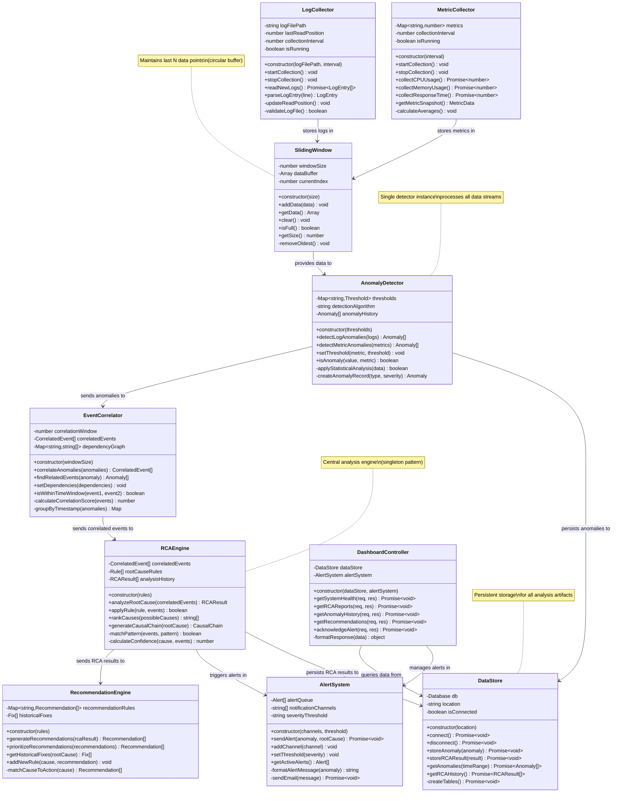

# UML Class Diagram - Automated Root Cause Analysis Platform (ARCA)

**Part B, Q2 - CS331 Assignment 3**

This diagram shows the complete class structure for the Automated Root Cause Analysis Platform for Deployment Errors.

## System Architecture Overview

The system follows a pipeline architecture with the following layers:

1. **Data Collection Layer**: `LogCollector`, `MetricCollector`, `SlidingWindow`
2. **Analysis Layer**: `AnomalyDetector`, `EventCorrelator`
3. **Intelligence Layer**: `RCAEngine`, `RecommendationEngine`
4. **Presentation Layer**: `DashboardController`, `AlertSystem`
5. **Persistence Layer**: `DataStore`

---

## Complete UML Class Diagram

---

## Relationship Details

### Data Flow Chain (Analysis Pipeline)

1. **LogCollector → SlidingWindow**
   - Type: Association
   - Cardinality: 1 to 1
   - Description: LogCollector stores parsed log entries in sliding window buffer

2. **MetricCollector → SlidingWindow**
   - Type: Association
   - Cardinality: 1 to 1  
   - Description: MetricCollector stores performance metrics in sliding window

3. **SlidingWindow → AnomalyDetector**
   - Type: Association
   - Cardinality: 1 to 1
   - Description: Sliding window provides recent data points for anomaly detection

4. **AnomalyDetector → EventCorrelator**
   - Type: Association  
   - Cardinality: 1 to 1
   - Description: Detector sends identified anomalies for event correlation

5. **EventCorrelator → RCAEngine**
   - Type: Association
   - Cardinality: 1 to 1
   - Description: Correlator sends grouped related events for root cause analysis

6. **RCAEngine → RecommendationEngine**
   - Type: Association
   - Cardinality: 1 to 1
   - Description: RCA engine sends identified root causes for recommendation generation

7. **RCAEngine → AlertSystem**
   - Type: Association
   - Cardinality: 1 to 1
   - Description: Engine triggers alerts for critical issues requiring immediate attention

### Storage & Interface Layer

8. **AnomalyDetector → DataStore**
   - Type: Association
   - Cardinality: 1 to 1
   - Description: Detector persists all detected anomalies for historical tracking

9. **RCAEngine → DataStore**
   - Type: Association
   - Cardinality: 1 to 1
   - Description: Engine stores RCA results including root causes and evidence

10. **DashboardController → DataStore**
    - Type: Association
    - Cardinality: 1 to 1
    - Description: Controller queries datastore for historical data and reports

11. **DashboardController → AlertSystem**
    - Type: Association
    - Cardinality: 1 to 1
    - Description: Controller manages alert acknowledgments and notifications

---

## Design Patterns Used

1. **Pipeline Pattern**: Data flows through sequential processing stages from collection to analysis
2. **Singleton Pattern**: RCAEngine and DataStore ensure single instances
3. **Observer Pattern**: AlertSystem notifies subscribers when critical issues detected
4. **Repository Pattern**: DataStore abstracts data persistence layer
5. **Strategy Pattern**: AnomalyDetector supports multiple detection algorithms

---

## Key Design Decisions

1. **Sliding Window**: Maintains only recent data to optimize memory usage and focus on short-term trends
2. **Threshold + Statistical Hybrid**: Combines rule-based and statistical approaches for robust anomaly detection
3. **Event Correlation**: Groups related anomalies by time proximity to reduce noise
4. **Rule-Based RCA**: Uses predefined patterns for fast and explainable root cause identification
5. **Asynchronous Operations**: All data operations return Promises for non-blocking execution

---

*This diagram represents the core architecture of the Automated Root Cause Analysis Platform for detecting and diagnosing deployment errors.*
