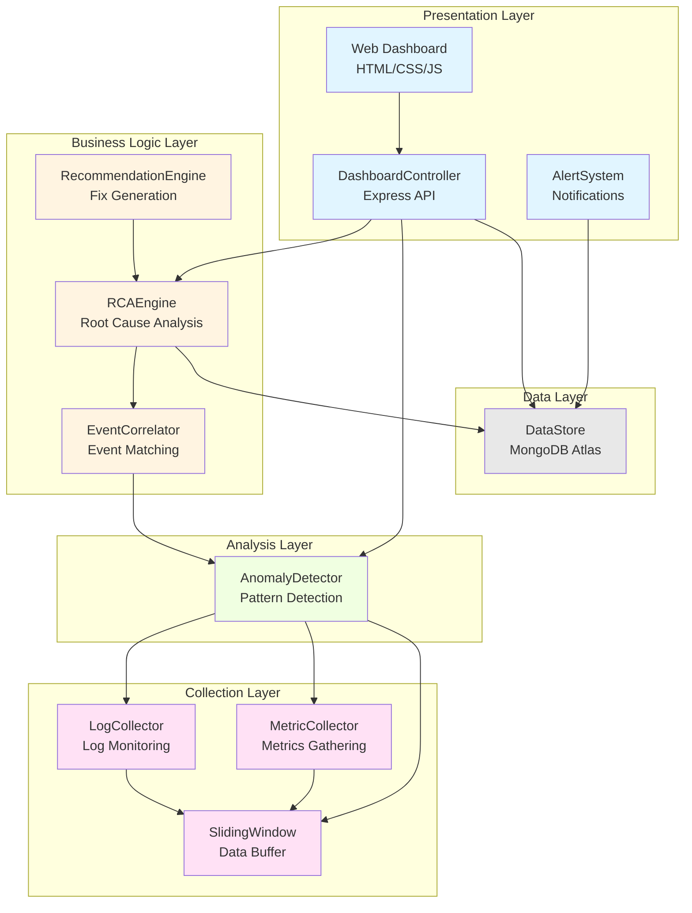

# Assignment 4 - Software Architecture Analysis

## I. Software Architecture Style

### Selected Architecture: **Layered (N-Tier) Architecture**

---

### A. Justification - Component Granularity

**Granularity Definition**: Components are organized into **5 distinct horizontal layers**, where each layer has a specific responsibility and depends only on layers below it.

#### Layer Structure:

**1. Presentation Layer** (Coarse-grained)
   - `DashboardController` - REST API endpoints
   - Web UI (HTML pages) - User interface
   - `AlertSystem` - Notification delivery

**2. Business Logic/Intelligence Layer** (Medium-grained)
   - `RCAEngine` - Root cause analysis logic
   - `RecommendationEngine` - Solution generation
   - `EventCorrelator` - Event relationship analysis

**3. Analysis Layer** (Fine-grained)
   - `AnomalyDetector` - Detection algorithms
   - Statistical analysis modules

**4. Data Collection Layer** (Fine-grained)
   - `LogCollector` - Log file monitoring
   - `MetricCollector` - Performance metrics
   - `SlidingWindow` - Buffer management

**5. Data Access Layer** (Coarse-grained)
   - `DataStore` - Database abstraction
   - MongoDB persistence

#### Granularity Evidence:

- **Vertical separation**: Each layer is self-contained with clear boundaries
- **Horizontal communication**: Layers communicate only through well-defined interfaces
- **Dependency direction**: Unidirectional (top-down) dependencies only
- **Component cohesion**: Each component has a single, well-defined responsibility
- **Encapsulation**: Implementation details hidden within layers

---

### B. Why Layered Architecture is Best

#### 1. **Maintainability** : EXCELLENT
   - **Separation of concerns**: Each layer handles distinct functionality
   - **Isolated changes**: Modification in one layer doesn't affect others
   - **Easy debugging**: Issues can be traced to specific layers
   - **Example**: Changing anomaly detection algorithm doesn't impact RCA logic

#### 2. **Scalability** : GOOD
   - **Horizontal scaling**: Deploy collection layer on multiple servers
   - **Layer independence**: Scale individual layers based on load
   - **Example**: Add more `MetricCollector` instances without changing other layers
   - **Note**: Not as scalable as microservices but sufficient for deployment monitoring

#### 3. **Performance** : GOOD
   - **Optimized data flow**: Sequential processing reduces overhead
   - **Minimal inter-layer calls**: Direct method invocation (no network latency)
   - **Caching opportunities**: Each layer can implement caching
   - **Trade-off**: Slightly slower than monolithic but more organized

#### 4. **Testability** : EXCELLENT
   - **Unit testing**: Each layer tested independently
   - **Mock interfaces**: Easy to mock lower layers
   - **Integration testing**: Test layer interactions systematically

#### 5. **Reusability** : GOOD
   - **Pluggable components**: Swap implementations within layers
   - **Example**: Replace `AnomalyDetector` with ML-based version without changing RCA layer

#### 6. **Development Efficiency** : EXCELLENT
   - **Parallel development**: Teams work on different layers simultaneously
   - **Clear contracts**: Well-defined interfaces between layers
   - **Technology flexibility**: Each layer can use different technologies (Python for analysis, Node.js for presentation)

#### 7. **Security** : GOOD
   - **Access control**: Enforce security at presentation layer
   - **Data validation**: Each layer validates inputs
   - **Authentication**: Centralized in presentation layer (JWT tokens)

#### Comparison with Alternatives:

| Criteria -------| Layered    | Microservices | Monolithic |
|-----------------|------------|---------------|------------|
| Maintainability | ⭐⭐⭐⭐ | ⭐⭐⭐⭐⭐ | ⭐⭐      |
| Scalability     | ⭐⭐⭐    | ⭐⭐⭐⭐⭐ | ⭐⭐      |
| Performance     | ⭐⭐⭐⭐ | ⭐⭐⭐      | ⭐⭐⭐⭐⭐ |
| Complexity      | ⭐⭐⭐    | ⭐           |⭐⭐⭐⭐⭐ |
| Team Size       | Medium     | Large         | Small |

**Conclusion**: Layered architecture provides the **optimal balance** for a deployment monitoring platform that needs maintainability and moderate scalability without microservices complexity.

---

## II. Application Components

### Component Inventory (10 Components)

#### **1. LogCollector**
   - **Type**: Data Collection Component
   - **Function**: Monitors log files and extracts new entries
   - **Key Operations**:
     - Continuous file monitoring with incremental reading
     - Log entry parsing (timestamp, level, message)
     - Real-time streaming to analysis layer
   - **Dependencies**: File system, SlidingWindow

#### **2. MetricCollector**
   - **Type**: Data Collection Component
   - **Function**: Gathers system performance metrics
   - **Key Operations**:
     - CPU usage monitoring
     - Memory utilization tracking
     - Response time measurement
     - Network I/O metrics
   - **Dependencies**: System APIs, SlidingWindow

#### **3. SlidingWindow**
   - **Type**: Data Management Component
   - **Function**: Maintains recent data buffer (circular buffer pattern)
   - **Key Operations**:
     - Fixed-size data retention
     - Automatic old data eviction
     - Efficient memory management
   - **Dependencies**: None (utility component)

#### **4. AnomalyDetector**
   - **Type**: Analysis Component
   - **Function**: Identifies abnormal patterns in logs and metrics
   - **Key Operations**:
     - Threshold-based detection (CPU > 80%, Memory > 85%)
     - Statistical analysis (mean + 2×std deviation)
     - Keyword pattern matching ("deployment failed", "timeout")
     - Severity classification (LOW/MEDIUM/HIGH/CRITICAL)
   - **Dependencies**: LogCollector, MetricCollector
   - **Implementation**: Python with statistical libraries

#### **5. EventCorrelator**
   - **Type**: Analysis Component
   - **Function**: Links related anomalies across time and services
   - **Key Operations**:
     - Time-window correlation (5-minute windows)
     - Dependency graph analysis
     - Event grouping by causality
     - Correlation score calculation
   - **Dependencies**: AnomalyDetector

#### **6. RCAEngine** (Root Cause Analysis Engine)
   - **Type**: Business Logic Component
   - **Function**: Determines root causes of system failures
   - **Key Operations**:
     - Rule-based pattern matching
     - Causal chain generation
     - Confidence scoring (0.0-1.0)
     - Evidence collection
   - **Dependencies**: EventCorrelator
   - **Implementation**: Python with rule engine

#### **7. RecommendationEngine**
   - **Type**: Business Logic Component
   - **Function**: Generates actionable fix recommendations
   - **Key Operations**:
     - Maps root causes to solutions
     - Historical fix retrieval
     - Recommendation prioritization
     - Automated action suggestions
   - **Dependencies**: RCAEngine

#### **8. DashboardController**
   - **Type**: Presentation Component (API Layer)
   - **Function**: REST API for web dashboard
   - **Key Operations**:
     - GET `/api/system-health` - Current system status
     - GET `/api/rca-reports` - RCA analysis history
     - GET `/api/anomalies` - Anomaly timeline
     - POST `/api/alerts/acknowledge` - Alert management
   - **Dependencies**: All business logic components, DataStore
   - **Implementation**: Node.js + Express

#### **9. AlertSystem**
   - **Type**: Notification Component
   - **Function**: Real-time critical issue notifications
   - **Key Operations**:
     - Multi-channel alerts (email, Slack, SMS)
     - Severity-based filtering
     - Alert queue management
     - Alert acknowledgment tracking
   - **Dependencies**: AnomalyDetector, RCAEngine

#### **10. DataStore**
   - **Type**: Data Access Component
   - **Function**: Persistent storage abstraction layer
   - **Key Operations**:
     - Anomaly record persistence
     - RCA result archival
     - Historical data queries
     - Time-range filtering
   - **Dependencies**: MongoDB Atlas (cloud database)
   - **Schema**: Users, Anomalies, RCAResults, Metrics collections

---

## Architecture Diagram

---

## Summary

- **Architecture**: Layered (5-tier)
- **Total Components**: 10
- **Primary Language**: Python (analysis) + Node.js (presentation)
- **Database**: MongoDB Atlas (cloud)
- **Deployment**: Suitable for single server or containerized multi-instance deployment
- **Best For**: Medium-scale deployment monitoring with emphasis on maintainability
